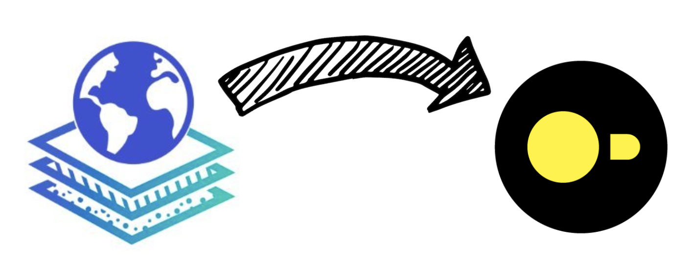

# OvertureMaps2DuckDB

🚧 Readme and project still in construction



[DuckDB](https://duckdb.org/) is a fast, lightweight open-source SQL database, ideal for big data analysis.

[Overture Maps Foundation](https://overturemaps.org/), in partnership with Amazon Web Services (AWS), Meta, Microsoft and TomTom and other companies, aims to develop open, reusable mapping products.

The aim of this project is to provide scripts and tools to easily retrieve data from OvertureMaps into a DuckDB database on a given right-of-way.

# How to use

## 🛠️ Create venv and install dependencies

```bash
python3 -m venv .venv 
source .venv/bin/activate
python3 -m pip install -r requirements.txt
```

## 📝 Complete the parameters in config.ini

These are :

- The desired bbox
- The database path
- Release of data to be used

## 🚀 Run the script

All Overture Maps data on the chosen bbox will be uploaded to the database.

```bash
python3 OvertureMaps2DuckDB.py
```